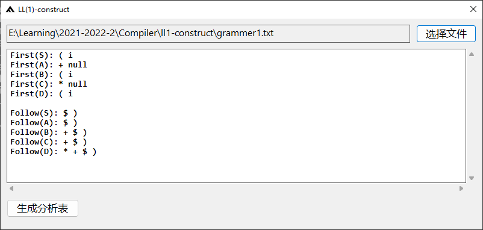
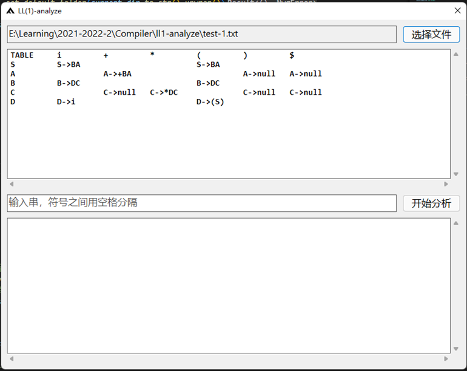
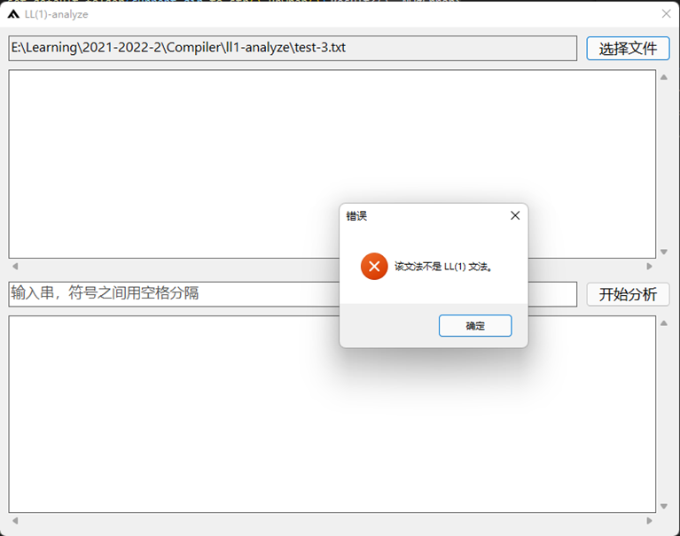
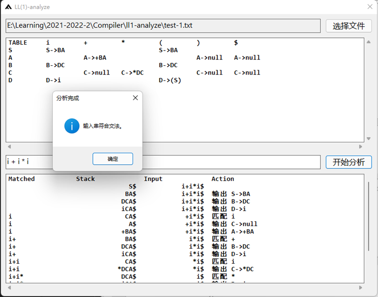

# ll1-grammatical-analysis

*编译技术课程实验*

## ll1-construct

提供文法的存储文件，该程序能够计算 FIRST 和 FOLLOW 集合，能够生成并存储对应的 LL（1）分析表。

- 文法存储格式

  - 第一行：开始符号；
  - 第二行：所有非终结符，包含开始符号；
  - 第三行：所有终结符。

- 文法存储示例

  - 文法：

    - ```text
      S -> BA
      A -> +BA | ε
      B -> DC
      C -> *DC | ε
      D -> (S) | i
      ```

  - 对应的文件（.txt）

    - ```text
      S
      S A B C D
      i + * ( ) $
      S->BA
      A->+BA|null
      B->DC
      C->*DC|null
      D->(S)|i
      ```

- 程序运行示例

  - 

- 生成的 LL（1）分析表示例

  - 分析表文件（.txt）

    - ```text
      S i S->BA
      S +
      S *
      S ( S->BA
      S )
      S $
      A i
      A + A->+BA
      A *
      A (
      A ) A->null
      A $ A->null
      B i B->DC
      B +
      B *
      B ( B->DC
      B )
      B $
      C i
      C + C->null
      C * C->*DC
      C (
      C ) C->null
      C $ C->null
      D i D->i
      D +
      D *
      D ( D->(S)
      D )
      D $
      ```


## ll1-analyze

给出 LL（1）分析表的存储文件，程序能够判定文法是否是 LL（1）文法；如果是，可以输入一个字符串（符号之间需用空格分隔），程序会判定该字符串是否符合文法并输出分析过程。

- 分析表存储格式

  - 每一行依次存储非终结符A、输入符号a和它们对应的产生式，用空格分隔，按行列位置顺序排列。

- 分析表存储文件示例

  - 分析表

    - |      | i     | +      | *      | (      | )    | $    |
      | ---- | ----- | ------ | ------ | ------ | ---- | ---- |
      | S    | S->BA |        |        | S->BA  |      |      |
      | A    |       | A->+BA |        |        | A->ε | A->ε |
      | B    | B->DC |        |        | B->DC  |      |      |
      | C    |       | C->ε   | C->*DC |        | C->ε | C->ε |
      | D    | D->i  |        |        | D->(S) |      |      |

  - 对应的文件（.txt）
  
    - ```text
      S i S->BA
      S +
      S *
      S ( S->BA
      S )
      S $
      A i
      A + A->+BA
      A *
      A (
      A ) A->null
      A $ A->null
      B i B->DC
      B +
      B *
      B ( B->DC
      B )
      B $
      C i
      C + C->null
      C * C->*DC
      C (
      C ) C->null
      C $ C->null
      D i D->i
      D +
      D *
      D ( D->(S)
      D )
      D $
      ```
  
- 程序判定示例

  - 文法是 LL（1）文法的情况
    - 
  - 文法不是 LL（1）文法的情况
    - 

- LL（1）分析示例

  - 